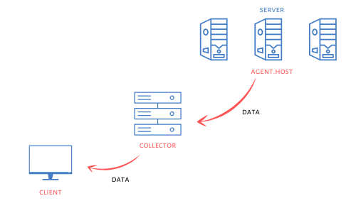
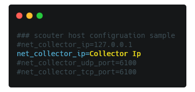
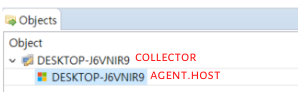

# :zap: Scouter-Tutorial
Scouter Tutorial For OpenILab

> [Scouter](https://github.com/scouter-project/scouter/blob/master/README_kr.md)

## :green_book: Ready
- Agent(Server) => __[DATA]__ => Collector
- Collector = > __[DATA]__ => Client(Viewer)



## :eye: Monitoring target
- Windows Server

## :desktop_computer: Installation
- [x] Do not include `Korean` in path

### Collector
1. Prerequisite
- Install JDK 1.8+
2. Download the latest version of __scouter-all-[version].tar.gz__
- [Release Page](https://github.com/scouter-project/scouter/releases)
3. Unzip the file
4. Execute

```
> cd scouter/server
> startup.bat
```

You can see this
```
  ____                  _
 / ___|  ___ ___  _   _| |_ ___ _ __
 \___ \ / __/   \| | | | __/ _ \ '__|
  ___) | (_| (+) | |_| | ||  __/ |
 |____/ \___\___/ \__,_|\__\___|_|
 Scouter version 0.0.1 ${date}
 Open Source Performance Monitoring
 System JRE version : 1.8.0_241
```

5. *(Option)* Configuration
- Default TCP/UDP Port
  - `6100`
- Configuration file
  - `server/conf/scouter.conf`
  
  
### Agent
1. Prerequisite
- Install JDK 1.8+
2. Download the latest version of __scouter-all-[version].tar.gz__
- [Release Page](https://github.com/scouter-project/scouter/releases)
3. Unzip the file
4. Configuration

```
> cd scouter/agent.host/conf
> notepad scouter.conf (or vi scouter.conf)
```



5. Execute

```
> cd scouter/agent.host
> startup.bat
```

You can see this

```
____                  _
 / ___|  ___ ___  _   _| |_ ___ _ __
 \___ \ / __/   \| | | | __/ _ \ '__|
  ___) | (_| (+) | |_| | ||  __/ |
 |____/ \___\___/ \__,_|\__\___|_|
 Open Source S/W Performance Monitoring
 Scouter version 2.7.1

Configure -Dscouter.config=.\conf\scouter.conf
Scouter Host Agent Version 2.7.1 2020-01-04 06:36 GMT
System JRE version : 1.8.0_241
```


### Client
1. Prerequisite
- Install JRE 1.8+
2. Download the latest version of __scouter.client.product-${os}[.tar.gz|.zip]__
- [Release Page](https://github.com/scouter-project/scouter/releases)
3. Unzip the file
4. Execute
- scouter.exe
5. Info
- Server Address
  - collector server address
- Default Id/Pwd
  - admin/admin  
  
  
  ## Use Client
  
